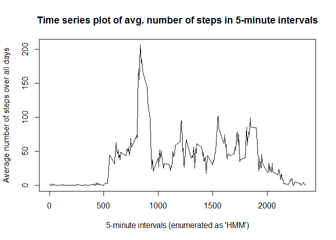

# Reproducible Research: Peer Assessment 1

## Introduction

This assignment makes use of data from a personal activity monitoring device. This device collects data at 5 minute intervals through out the day. The data consists of two months of data from an anonymous individual collected during the months of October and November, 2012 and include the number of steps taken in 5 minute intervals each day.

## About the data

The variables included in this dataset are:

* **steps**: Number of steps taking in a 5-minute interval (missing values are coded as  NA )
* **date**: The date on which the measurement was taken in YYYY-MM-DD format
* **interval**: Identifier for the 5-minute interval in which measurement was taken

The dataset is stored in a comma-separated-value (CSV) file and there are a total of 17,568 observations in this dataset.

## Loading and preprocessing the data


```r
# load packages
library(plyr)
```

```
## Warning: package 'plyr' was built under R version 3.1.3
```

```r
library(lubridate)
```

```
## Warning: package 'lubridate' was built under R version 3.1.3
```

```
## 
## Attaching package: 'lubridate'
## 
## The following object is masked from 'package:plyr':
## 
##     here
```

```r
library(ggplot2)
```

```
## Warning: package 'ggplot2' was built under R version 3.1.3
```

```r
# unzip data
unzip("activity.zip")
# load datea
data <- read.csv("activity.csv")
# convert date column to date format
data$date <- ymd(data$date)
```

## What is mean total number of steps taken per day?

First we'll make a histogram of the total number of steps taken each day.


```r
daily <- ddply(data, .(date), summarise, 
                        sum_steps = sum(steps, na.rm = TRUE))
hist(daily$sum_steps, xlab = "Total steps each day", 
     main = "Histogram of total number of steps taken each day",
     col = "green")
```

 

Then we'll calculate the **mean** and **median** total number of steps taken per day.


```r
summary(daily$sum_steps)
```

```
##    Min. 1st Qu.  Median    Mean 3rd Qu.    Max. 
##       0    6778   10400    9354   12810   21190
```

## What is the average daily activity pattern?

Here is a time series plot of the average number of steps within each 5-minute interval taken across all days. The 5-minute intervals are enumerated as "HMM" where H = hour and MM = minutes of starting time of the interval. E.g. "245"" = 2:45 am).


```r
intervals_all <- ddply(data, .(interval), summarise, avg_steps = mean(steps, na.rm = TRUE))
plot(intervals_all, type = 'l', xlab = "5-minute intervals (enumerated as 'HMM')",
     ylab = "Average number of steps over all days",
     main = "Time series plot of avg. number of steps in 5-minute intervals")
```

 

I use the 'which' function to find the index in the intervals data frame that contains the 5-minute interval having the maxium number of steps on average across all the days in the dataset. Remember that the interval is encoded as "HMM", where H = hour and MM = minutes., as the starting time of the 5-minute interval.


```r
intervals_all[which.max(intervals_all[,2]),]
```

```
##     interval avg_steps
## 104      835  206.1698
```


## Imputing missing values

This is one way of finding the total number of missing step values (NA) in the dataset:


```r
na <- summary(data$steps)[7]
```
There are 2304 intervals with missing step values in the data set.

I think a sensible strategy for imputing missing data is to use the mean value of the 5-minute period over all days. So I will go with that approach.


```r
# I use a for loop over the 'data' data frame to replace all NA values with the mean 
# value of the 5-minute interval, which we have already computed in the 'intervals' DF.
data2 <- data
for (i in 1:nrow(data2)) {
    if (is.na(data2[i,1])) {
        data2[i,1] = as.integer(intervals_all[intervals_all$interval == data2[i,3],2])
    }
}
```

Using the new data set without NAs, I create a histogram of the total number of steps taken each day.


```r
daily2 <- ddply(data2, .(date), summarise, 
                        sum_steps = sum(steps, na.rm = TRUE))
hist(daily2$sum_steps, xlab = "Total steps each day", 
     main = "Histogram of total number of steps taken each day, missing values imputed",
     col = "blue")
```

 

Then we'll re-calculate the **mean** and **median** total number of steps taken per day.


```r
summary(daily2$sum_steps)
```

```
##    Min. 1st Qu.  Median    Mean 3rd Qu.    Max. 
##      41    9819   10640   10750   12810   21190
```

The **mean** and **meadian** has increased after we filled in missing values. This is expected.The histogram looks much more like a normal distribution, with the left bias almost gone.

## Are there differences in activity patterns between weekdays and weekends?

I first need to create a new factor variable in the dataset with two levels ("weekday" and "weekend") indicating whether a given date is a weekday or weekend day.


```r
x = vector("character", length = nrow(data2))
for (i in 1:nrow(data2)) {
    w = weekdays(data2[i,2])
    # this test assumes "Norwegian" locale :)
    if (w == "lørdag" || w == "søndag") {
        x[i] = "weekend"
    } else {
        x[i] = "weekday"
    }
}
data2$day = factor(x)
```

Here is a panel plot with actvity on weekdays vs weeekends:

```r
p <- qplot(interval, steps, data = data2, facets = ~ day, geom = "line",
           xlab = "5-minute intervals (enumerated as 'HMM')",
           ylab = "Average number of steps over all days",
           main = "Time series plot of avg. number of steps in 5-minute intervals")
print(p, width = 480, height = 480)
```

 
On average the number of steps are higher in the morning on weekdays than on weekends.
